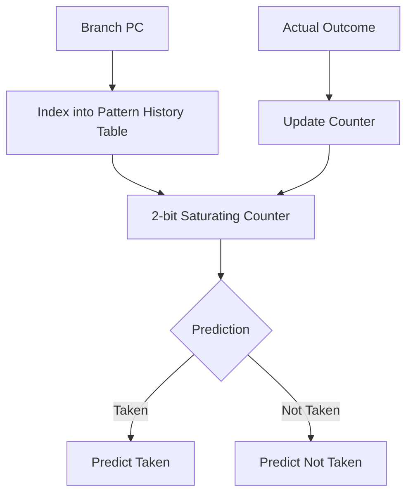
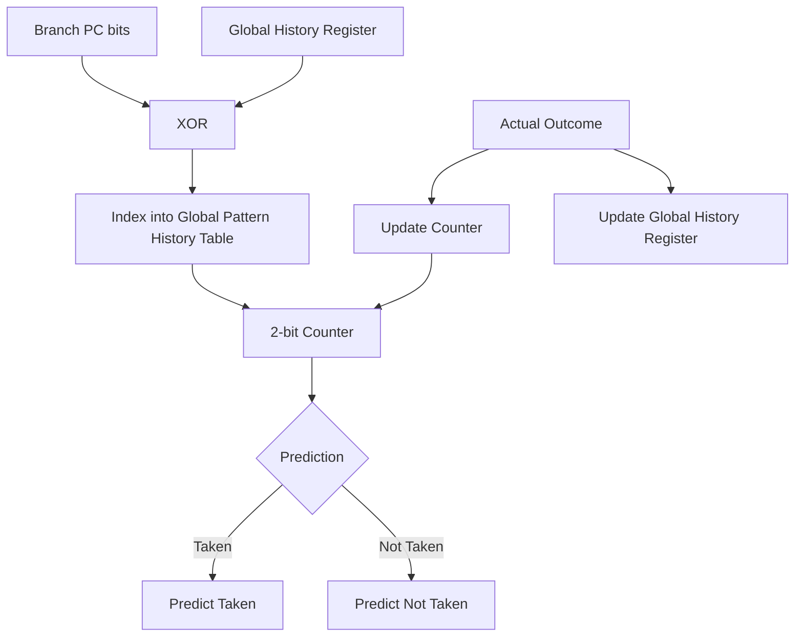
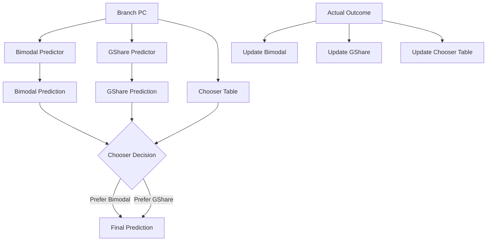
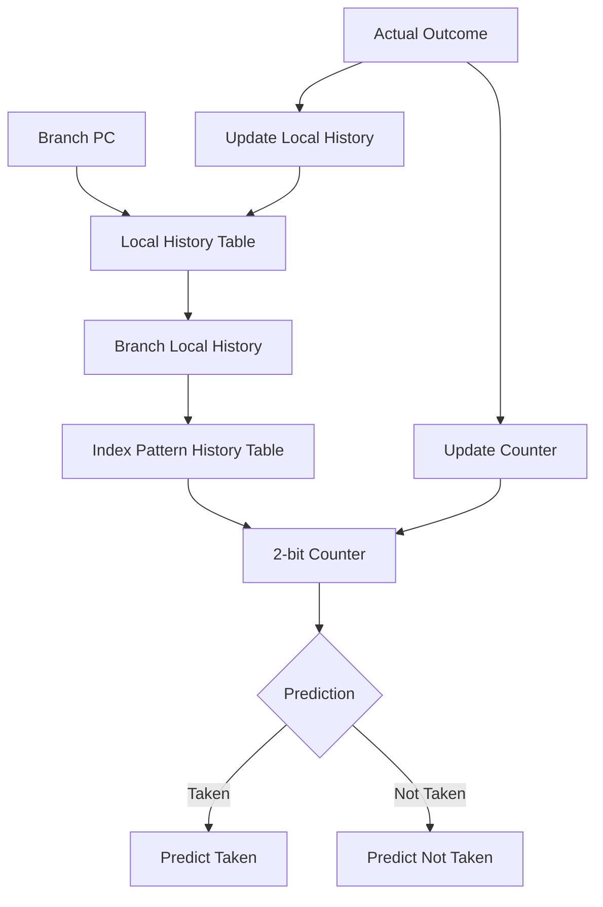
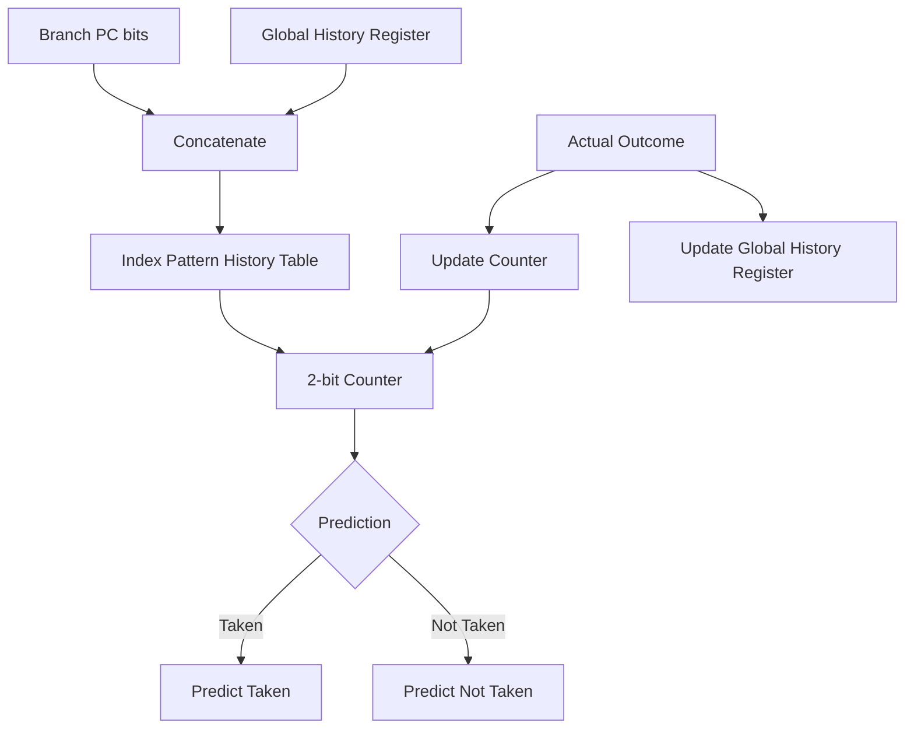
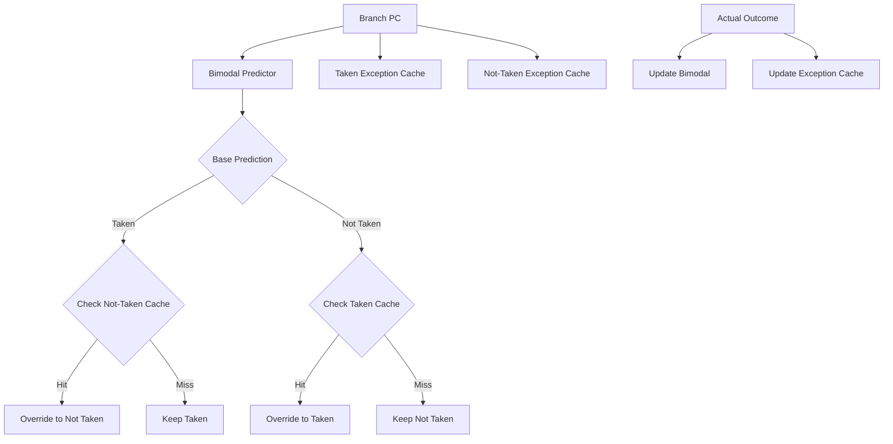

# Branch Prediction Simulator - Predictors

This directory contains the core implementation of several branch prediction algorithms used in the simulator. The predictors inherit from a common base class to ensure a uniform interface.

## Base Classes and Utilities
### 1. `Predictor.hpp`
Defines the `Predictor` abstract base class. It exposes a clean interface requiring two methods for any predictor subclass: `predict(uint64_t address)` and `update(uint64_t address, bool actual)`.

### 2. `Branch.hpp`
Defines a simple `Branch` structure, encapsulating the `address` (Program Counter) and the boolean `wasTaken` representing the actual outcome of the branch.

---

## Predictor Implementations

### 1. Bimodal Predictor (`BiModalPredictor.hpp`)
**Logic:** This approach is purely address-based. It uses the lowest bits of the branch program counter (PC) to index into a Pattern History Table (PHT) consisting of 2-bit saturating counters. The counter manages 4 states (Strongly/Weakly Taken/Not Taken) providing basic repetitive predictability.

### 2. GShare Predictor (`GSharePredictor.hpp`)
**Logic:** Incorporates a Global History Register mapping the overall branch direction path recently taken. It uses the **XOR** of the Global History Register and the branch PC to determine an index in the global Pattern History Table. This securely captures path-based correlation while successfully spreading identical indices to prevent destructive aliasing.

### 3. Tournament / Hybrid Predictor (`HybridPredictor.hpp`)
**Logic:** Integrates two distinct predictors—typically a Bimodal and a GShare predictor. It employs a **Chooser Table** (acting as another 2-bit saturating counter array) indexed purely by the branch PC to dynamically discern which of the two base predictors is currently proving to be more accurate on a branch-by-branch basis.

### 4. Local History Predictor (`LocalPredictor.hpp`)
**Logic:** Retains history localized down to individual branch behaviors. The branch PC serves as an index into a Local History Table (LHT) to procure the history pattern unique to that branch. This historical pattern alone fetches the prediction indexed onto a global Pattern History Table (PHT) of 2-bit counters.

### 5. GSelect Predictor (`GSelectPredictor.hpp`)
**Logic:** Operates conceptually similarly to GShare, but creates the lookup index using a robust **concatenation** of the appropriate lower PC bits and the active bits from the global history register.

### 6. YAGS Predictor (`YAGSPredictor.hpp`)
**Logic:** Extrapolated as "Yet Another Global Scheme", it optimizes table space and lowers false tracking. Employs a Bimodal predictability table for baselining. When the actual outcome mismatches baseline prediction based on global history, it consults discrete **Exception Caches**: specific Caches mapped for paths contradicting "Taken" against "Not-Taken". Caches verify hit/miss using explicitly mapped `tag` identifiers.

